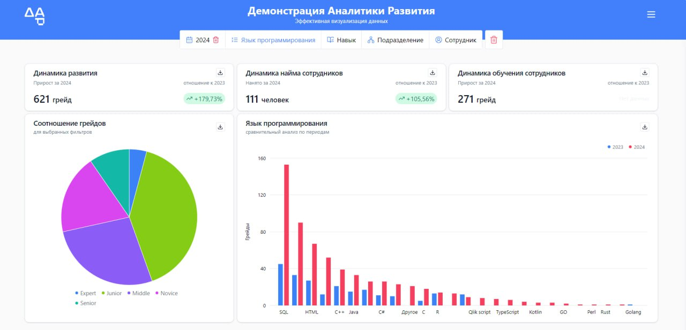

# Team 6 Project

## Цели проекта
 - Возможность наблюдения за приростом навыков конкретных сотрудников и их сравнение с коллегами.
 - Отображение текущего статуса развития навыков сотрудников и изменений за период для оценки эффективности обучения.- Отслеживание прироста навыков 

## Аналитические цели дашборда

 - Отображение информации: Количество обучающихся сотрудников, данные об их профессиональном развитии, обновления резюме.
 - Фильтрация данных: По периодам, ролям, уровням квалификации и технологиям.
 - Выгрузка данных: Осуществляется по центрам компетенций и отделам.

## Пользователи дашборда
Дашборд предназначен для HR директора департамента аналитических решений, HR-специалистов и руководителей подразделений.

  

